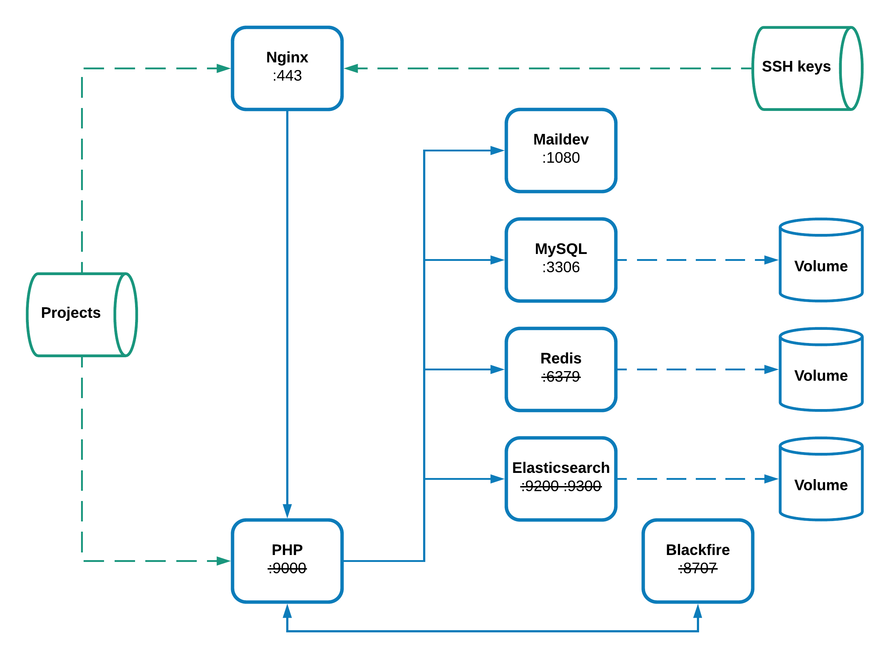

# Docker for Proximis []
This repository allows the creation of a Docker environment that meets
[Proximis](http://doc.omn.proximis.com/omn/3.8/developer/environnement.html) requirements.

## Architecture

## Services
* `blackfire`: [blackfire/blackfire:latest](https://hub.docker.com/r/blackfire/blackfire/) image (application profiling).
* `elasticsearch`: [docker.elastic.co/elasticsearch/elasticsearch:5.5.0](https://github.com/EmakinaFR/docker-proximis/blob/master/elasticsearch/Dockerfile) custom image with some plugins (search engine).
* `maildev`: [djfarrelly/maildev:latest](https://hub.docker.com/r/djfarrelly/maildev/) image (emails debugging).
* `mysql`: [mysql:5.7](https://store.docker.com/images/mysql) image (Proximis database).
* `nginx`: [nginx:1.15-alpine](https://github.com/EmakinaFR/docker-proximis/blob/master/nginx/Dockerfile) custom image with HTTPS (web server).
* `php` : [php:7.2-fpm-alpine](https://github.com/EmakinaFR/docker-proximis/blob/master/php/Dockerfile) custom image with additional extensions and Composer.
* `redis`: [redis:4-alpine](https://store.docker.com/images/redis) image (Proximis session and caches).

## Documentation
> In order to make things more readable, and maintainable, the documentation has been migrated to
the [repository Wiki](https://github.com/EmakinaFR/docker-proximis/wiki). Where you will find all details about the 
installation process along the available instructions for the day-to-day work. 
